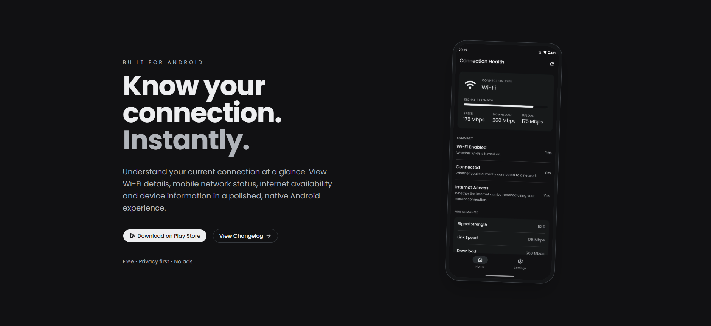
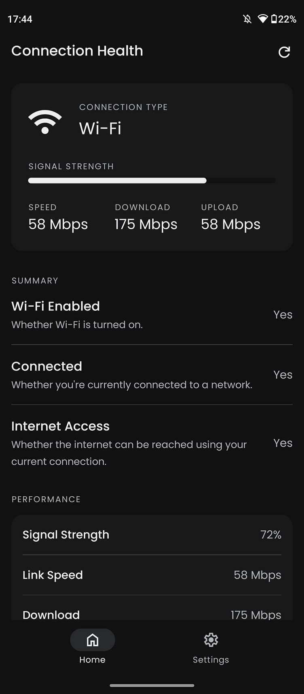
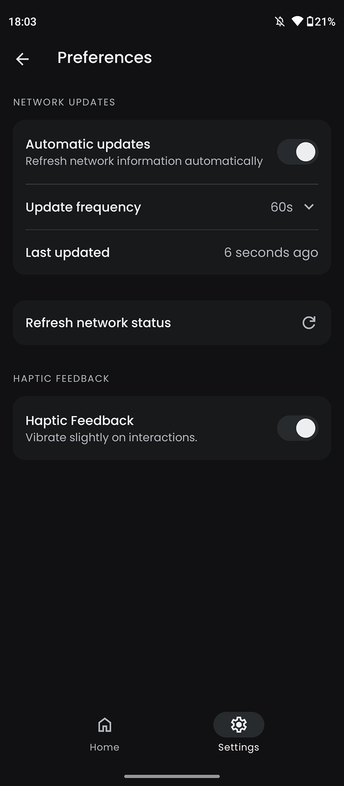
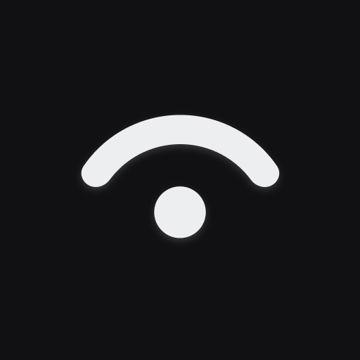

<div align="center">



# My Connection

> Understand your connection.

A mobile app for understanding your connection, signal, performance, and network details clearly.

<br />

[Website](https://myconnection.zanin.dev) ·
[Play Store](https://play.google.com/store/apps/details?id=dev.zanin.myconnection) ·
[Changelog](https://myconnection.zanin.dev/changelog) ·
[Privacy](https://myconnection.zanin.dev/privacy)

<br />


</div>

---

## What is My Connection?

My Connection makes network information easier to understand.

It brings together connection status, signal strength, performance, Wi-Fi details, IP configuration, and other network properties in one place.

The goal isn't to expose as much technical information as possible.

It's to make the information that *is* available useful and easy to understand.

## Why I built it

The idea started with a simple question:

**🤔 Where is the best place in my home for a reliable Wi-Fi connection?**

I wanted to walk around the house and understand how the connection changed from one place to another.

Answering that question usually meant jumping between system settings, network utilities, and speed tests.

So I built My Connection.

What started as a small experiment became a full mobile application focused on turning low-level network information into a clear, practical experience.

## See your connection

My Connection organizes network information around the things you
actually want to know.

### Connection

Start with the basics.

See what you're connected to and the current state of your connection.

### Performance

For Wi-Fi connections, the app surfaces information such as:

- Signal strength
- Link speed
- Download link speed
- Upload link speed

This makes it easier to compare different places and understand how your connection behaves.

### Network

When connected through Wi-Fi, the app can provide details such as:

- Network name (SSID)
- BSSID
- Frequency

### IP configuration

For supported connection types, the app can provide:

- IP address
- Subnet information

### Connection properties

Additional properties are shown when supported by the current
connection type.

For cellular connections, this can include carrier and cellular
generation information.

## Built around the platform

Network information is only as useful as the information the platform makes available.

My Connection treats platform behavior and permissions as part of the product experience.

The application adapts its interface to the current connection type and only presents information that is relevant to it.

Supported connection types include:

- Wi-Fi
- Cellular
- Ethernet
- VPN
- Bluetooth
- Other platform-supported connection types

Permissions and unavailable information are also handled explicitly, so the interface can explain why a particular piece of information may not be available.

## Built to ship

My Connection is developed as a **real-world mobile application**, with the tooling and infrastructure needed to build, validate, observe, and ship it continuously.

### Development

- TypeScript-first codebase
- Expo Router
- Modular React Native architecture
- Bun-based workflow
- Biome for formatting and linting

### Quality

- Automated CI on pushes and pull requests
- Type checking
- Linting
- Expo Doctor validation
- Separate development, preview, and production environments

### Distribution

- Automated production builds
- Google Play distribution
- Release workflow for production versions
- Public changelog (sort of dev notes)
- Production application configuration

### Internationalization

The application is localized using `i18next` and currently supports:

- English
- Portuguese
- Spanish

Localization is treated as part of the product architecture rather than as a final step before release.

### Observability

The project uses:

- Sentry for error monitoring
- Expo Observe for application observability
- Structured application events

### Platform integration

The application also makes use of platform capabilities such as:

- Network state information
- Location permission handling for Wi-Fi information (SSID and BSSID)
- Haptics
- System appearance
- M3 Android Dynamic Colors
- Application lifecycle events

## Architecture

The project uses a modular React Native architecture with a clear separation between screens, components, hooks, contexts, services, repositories, and platform concerns.

```text
src/
├── app/
├── assets/
├── components/
├── contexts/
├── hooks/
├── i18next/
├── repositories/
├── screens/
├── services/
├── theme/
└── utils/
```

The home experience is composed from focused sections rather than putting all network logic and presentation into a single screen.

This keeps platform-specific behavior isolated and makes individual parts of the experience easier to evolve.

## Network updates

My Connection can periodically refresh network information while the application is in use.

Update frequency can be configured by the user, while the application also takes its lifecycle into account to avoid unnecessary work when the app is not active.

The interface keeps track of the latest update so the user can understand how current the displayed information is.

## Permissions

Some network information is subject to platform restrictions.

On Android, certain Wi-Fi information requires location permission even though My Connection does not need to track the user's physical location.

The application therefore treats permissions as part of the network experience rather than hiding them behind technical
details.

It handles states including:

- Permission not yet requested
- Permission granted
- Permission denied
- Permission that can no longer be requested
- Reduced/approximate permission
- Location services disabled

## Screenshots

The application is designed around a simple information hierarchy:
start with the current connection, then explore more detailed
information when needed.

<table>
  <tbody>
    <tr>
      <td>
        
      </td>
      <td>
        
      </td>
    </tr>
  </tbody>
</table>

## Contributing

My Connection is open source, and contributions are welcome.

Whether you want to fix a bug, improve the documentation, add a translation, refine the user experience, or work on the technical foundations of the project, feel free to contribute.

Before opening an issue or pull request, please read:

- [Contributing Guide](.github/CONTRIBUTING.md)
- [Code of Conduct](.github/CODE_OF_CONDUCT.md)

For bugs and feature ideas, you can also
[open an issue](https://github.com/MattZ6/my-connection/issues).

## License

My Connection is licensed under the [MIT License](LICENSE.md).

Copyright © 2026 Matheus Zanin.

---

<div align="center">
  

 > Understand your connection.
</div>
